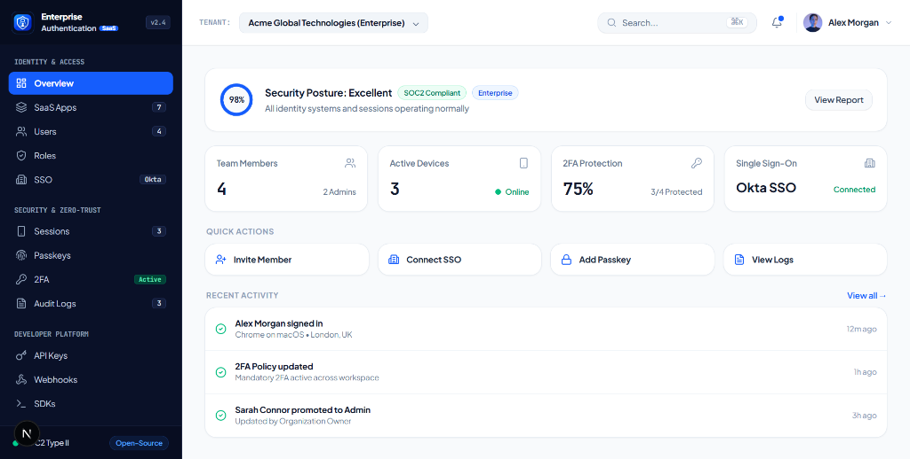
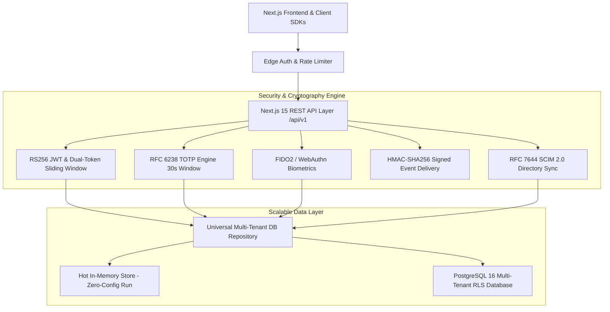
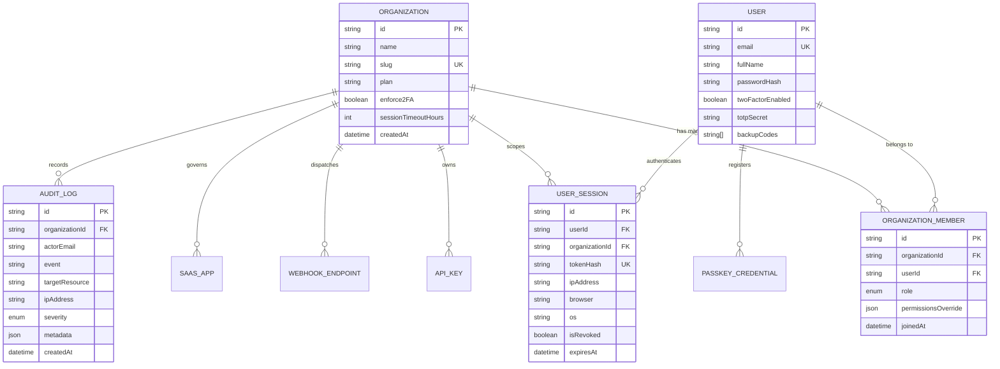

# 🛡️ Enterprise Authentication SaaS (EA SaaS)

<div align="center">

[](LICENSE)
[](https://nextjs.org/)
[](https://www.typescriptlang.org/)
[](https://tailwindcss.com/)
[](https://www.prisma.io/)
[](docs/07_SECURITY_AND_COMPLIANCE.md)
[](https://webauthn.io/)

**Production-grade, open-source, multi-tenant Identity & Access Management (IAM) engine for modern B2B SaaS.**  
*Engineered as a high-performance open-source alternative to WorkOS, Auth0, and Clerk with zero per-user licensing fees.*

[Explore Features](#-core-features) • [System Architecture](#-system-architecture) • [Database Schema](#-database-architecture--erd) • [REST API Matrix](#-restful-api-specification) • [Quick Start](#-quick-start) • [Documentation](docs/)

<br />

<div align="center">
  
</div>

</div>

---

## 🏛️ System Architecture



---

## 🗄️ Database Architecture & ERD



---

## ⚡ RESTful API Specification

The platform exposes a comprehensive suite of type-safe REST APIs for client applications, microservices, and external IdP integrations:

| Method | Endpoint | Description | Auth Required |
| :--- | :--- | :--- | :--- |
| `GET` | `/api/v1/auth/jwks` | RFC 7517 Public JSON Web Key Set (JWKS) for RS256 token verification | Public |
| `POST` | `/api/v1/auth/login` | Authenticates identity, enforces 2FA policy, issues RS256 Dual-Token | Public / Rate-Limited |
| `POST` | `/api/v1/auth/2fa` | Validates 6-digit TOTP code or emergency single-use recovery keys | Public |
| `GET` | `/api/v1/organizations/:id/members` | Retrieves organization team directory with RBAC roles & 2FA status | Bearer JWT |
| `POST` | `/api/v1/organizations/:id/members` | Invites a new team member with cryptographic onboarding link | Bearer JWT (`Owner`/`Admin`) |
| `PATCH` | `/api/v1/organizations/:id/members` | Modifies member RBAC roles (`Owner`, `Admin`, `Member`, `Viewer`) | Bearer JWT (`Owner`/`Admin`) |
| `DELETE`| `/api/v1/organizations/:id/members` | Removes a member and purges all their active tenant sessions | Bearer JWT (`Owner`) |
| `GET` | `/api/v1/organizations/:id/sessions` | Lists all connected laptops, phones, and active zero-trust devices | Bearer JWT |
| `DELETE`| `/api/v1/organizations/:id/sessions` | Remotely kills an active session or revokes all other connected devices | Bearer JWT |
| `GET` | `/api/v1/organizations/:id/api-keys` | Lists machine API keys with environment badges (`Production`/`Staging`) | Bearer JWT |
| `POST` | `/api/v1/organizations/:id/api-keys` | Generates cryptographically hashed API keys with granular scopes | Bearer JWT (`Admin`) |
| `GET` | `/api/v1/organizations/:id/webhooks` | Lists registered webhook endpoints and delivery health statuses | Bearer JWT |
| `POST` | `/api/v1/organizations/:id/webhooks` | Registers a webhook endpoint or dispatches live HMAC-SHA256 test ping | Bearer JWT |
| `GET` | `/api/v1/organizations/:id/audit-logs`| Streams SOC2 compliance audit log events with instant CSV exporter | Bearer JWT |
| `GET` | `/api/v1/organizations/:id/saas-apps` | Discovers shadow IT SaaS apps with automated risk scores & governance | Bearer JWT |
| `GET` | `/api/v1/scim/v2/Users` | RFC 7644 SCIM 2.0 endpoint for automated Okta & Azure AD user sync | SCIM Bearer Token |
| `POST` | `/api/v1/scim/v2/Users` | Provisions new enterprise identity from corporate IdP directory | SCIM Bearer Token |

---

## 🌟 Core Features

### 1. 🏢 Enterprise Single Sign-On (SAML 2.0 & OIDC)
* Turnkey integration with **Okta**, **Microsoft Entra ID (Azure AD)**, and **Google Workspace**.
* Domain auto-discovery: users entering corporate emails (`@acmecorp.com`) are automatically routed to their organization's identity provider.

### 2. 👥 RFC 7644 SCIM 2.0 Automated User Provisioning
* Real-time automated employee onboarding, role mapping, and instant de-provisioning from corporate HR & IT directories.

### 3. 🔑 FIDO2 / WebAuthn Biometric Passkeys
* Phishing-resistant passwordless authentication utilizing **Apple Touch ID / Face ID**, **Windows Hello**, and **YubiKey** hardware tokens.

### 4. 🔒 RFC 6238 TOTP Multi-Factor Authentication
* 30-second rolling interval visualizer with HMAC-SHA1 validation, $\pm 1$ step clock drift tolerance, and 8 one-time emergency recovery codes.

### 5. 📱 Zero-Trust Active Session Manager
* Real-time device and browser fingerprinting with instant single-device revocation or 1-click **"Sign Out All Other Devices"** kill switch.

### 6. 📜 Tamper-Evident SOC2 Audit Logging
* Immutable compliance audit feed recording actors, IP addresses, target resources, and event severity levels with 1-click CSV export.

---

## 🚀 Quick Start

### 1. Clone & Install Dependencies
```bash
git clone https://github.com/bilalhusain-dev/enterprise-authentication-saas.git
cd enterprise-authentication-saas
npm install
```

### 2. Configure Environment Variables
```bash
cp .env.example .env
```
*(The repository is configured with a zero-config in-memory store by default, meaning it runs instantly without requiring local database setup!)*

### 3. Run Development Server
```bash
npm run dev
```
Open [http://localhost:3000](http://localhost:3000) (or `http://localhost:3004`) to launch the platform.

### 4. (Optional) Run with Local PostgreSQL & Redis
```bash
docker compose up -d
npx prisma db push
```

### 5. Execute Backend Automated API Test Suite
```bash
node scripts/test-api.mjs
```

---

## 💻 5-Line SDK Integration

```typescript
import { api } from '@/lib/api-client';

// 1. Authenticate user & receive RS256 Dual-Token
const auth = await api.auth.login('alex.morgan@acmecorp.com', 'password123');

// 2. List organization members
const { members } = await api.members.list('org_01H9A_ACME');

// 3. Remotely revoke compromised session
await api.sessions.revoke('org_01H9A_ACME', 'sess_device_id_99');

// 4. Trigger signed webhook test event
await api.webhooks.testPing('org_01H9A_ACME');
```

---

## 📑 Complete Specification Suite (`docs/`)

| File | Document Title | Description |
| :--- | :--- | :--- |
| [`01_BRD_AND_PRD.md`](docs/01_BRD_AND_PRD.md) | **Product Requirements Document** | Personas, user stories, acceptance criteria, and non-goals. |
| [`02_UI_UX_SPECIFICATION.md`](docs/02_UI_UX_SPECIFICATION.md) | **Information Architecture & UI Matrix** | Navigation matrix, layout slots, and design system. |
| [`03_SYSTEM_ARCHITECTURE.md`](docs/03_SYSTEM_ARCHITECTURE.md) | **System Architecture & Tech Specs** | Edge middleware, token lifecycles, and security model. |
| [`04_DATABASE_SCHEMA.md`](docs/04_DATABASE_SCHEMA.md) | **PostgreSQL Schema & ERD** | Production DDL, foreign keys, cascades, and B-tree indexes. |
| [`05_API_CONTRACTS.md`](docs/05_API_CONTRACTS.md) | **API Contracts & Zod Specs** | Type-safe REST request/response validation contracts. |
| [`06_CODING_HANDOVER.md`](docs/06_CODING_HANDOVER.md) | **Developer & AI Project GPS** | Zero-token direct file path and symbol mapping index. |
| [`07_SECURITY_AND_COMPLIANCE.md`](docs/07_SECURITY_AND_COMPLIANCE.md) | **Security & Cryptography Specs** | NIST 800-63B, OWASP ASVS Level 2, and SOC2 controls. |

---

## 🛡️ License

This project is open-source software licensed under the **MIT License**.  
Engineered with ❤️ by [Bilal Hussain](https://github.com/bilalhusain-dev).
