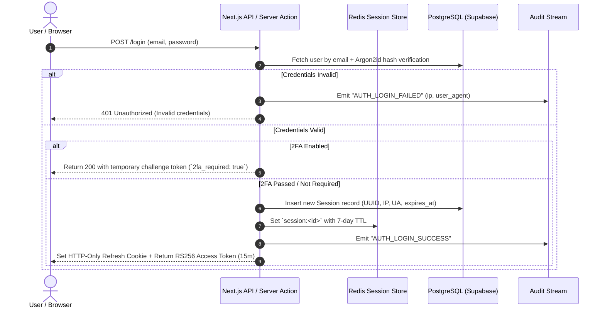

# 03 - System Architecture & Technical Specifications

**Project Name:** Enterprise Authentication SaaS  
**Short Name:** EA SaaS  
**Architecture Pattern:** Edge-First Modular Monolith with Redis Sliding Session Store & PostgreSQL RLS  

---

## 1. High-Level System Architecture

```
[ Client Application / Browser ]
           │  HTTPS / WSS
           ▼
[ Next.js Edge Middleware ] ──(Sub-ms Check)──> [ Redis Session & Rate-Limit Cache ]
           │  (Injects x-user-id, x-tenant-id, x-role)
           ▼
[ App Router Server Layer ]
   ├── Authentication Core (`src/features/auth`)
   ├── Multi-Tenant Manager (`src/features/organizations`)
   ├── RBAC Engine (`src/features/rbac`)
   ├── TOTP 2FA Service (`src/features/two-factor`)
   └── Async Audit Emitter (`src/features/audit-logs`)
           │
           ▼
[ PostgreSQL Multi-Tenant DB ] (Row-Level Security Scoped)
```

---

## 2. Authentication & Cryptographic Lifecycles

### 2.1 Dual-Token Authentication Lifecycle (JWT + Refresh Rotation)



---

## 3. Multi-Tenancy & Data Isolation Model

### Tenant Context Resolution
1. When a user navigates to `/dashboard/[orgSlug]/...`:
   - Edge Middleware checks session validity in Redis.
   - Verifies the user has an active membership record in `organization_members` matching `orgSlug`.
   - Injects HTTP headers: `x-tenant-id: <org_uuid>` and `x-tenant-role: <role_name>`.
2. All database queries execute with an enforced `organization_id = :tenantId` predicate to prevent data leakage between tenants.

---

## 4. Zero-Trust Session Revocation Architecture

- **Active Session Tracking:** Every login generates a unique `session_id`.
- **Sliding-Window Activity:** Every authenticated request updates `last_active_at` in Redis asynchronously without blocking response times.
- **Instant Kill Switch:**
  - When a user revokes a session or changes their password:
    1. The session record is marked `is_revoked = true` in PostgreSQL.
    2. Redis key `session:<id>` is deleted immediately.
    3. Added to a fast Redis blacklist key `revoked_token:<hash>` with a 15-minute TTL (matching JWT lifespan).
    4. Next.js Edge Middleware rejects any requests holding that revoked JWT in `< 2ms`.
