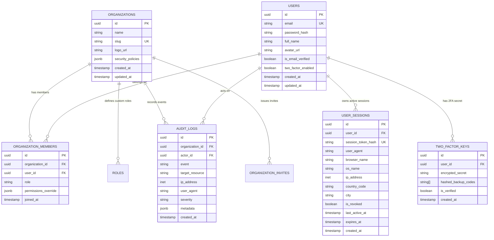

# 04 - Database Architecture & PostgreSQL Schema

**Project Name:** Enterprise Authentication SaaS  
**Short Name:** EA SaaS  
**Database Engine:** PostgreSQL 16+ (Supabase / Neon Compatible)  
**ORM / Query Builder:** Type-safe SQL with Zod Validation  

---

## 1. Entity Relationship Diagram (ERD)



---

## 2. Production PostgreSQL DDL Script

```sql
-- Enable cryptographic extensions
CREATE EXTENSION IF NOT EXISTS "uuid-ossp";
CREATE EXTENSION IF NOT EXISTS "pgcrypto";

-- 1. Organizations (Multi-Tenant Workspaces)
CREATE TABLE organizations (
    id UUID PRIMARY KEY DEFAULT gen_random_uuid(),
    name VARCHAR(255) NOT NULL,
    slug VARCHAR(100) UNIQUE NOT NULL,
    logo_url TEXT,
    security_policies JSONB NOT NULL DEFAULT '{"enforce_2fa": false, "session_timeout_hours": 168}',
    created_at TIMESTAMPTZ NOT NULL DEFAULT NOW(),
    updated_at TIMESTAMPTZ NOT NULL DEFAULT NOW()
);

-- 2. Users (Global Identity Directory)
CREATE TABLE users (
    id UUID PRIMARY KEY DEFAULT gen_random_uuid(),
    email VARCHAR(255) UNIQUE NOT NULL,
    password_hash VARCHAR(255),
    full_name VARCHAR(255) NOT NULL,
    avatar_url TEXT,
    is_email_verified BOOLEAN NOT NULL DEFAULT FALSE,
    two_factor_enabled BOOLEAN NOT NULL DEFAULT FALSE,
    created_at TIMESTAMPTZ NOT NULL DEFAULT NOW(),
    updated_at TIMESTAMPTZ NOT NULL DEFAULT NOW()
);

-- 3. Organization Memberships & Role Assignment
CREATE TABLE organization_members (
    id UUID PRIMARY KEY DEFAULT gen_random_uuid(),
    organization_id UUID NOT NULL REFERENCES organizations(id) ON DELETE CASCADE,
    user_id UUID NOT NULL REFERENCES users(id) ON DELETE CASCADE,
    role VARCHAR(50) NOT NULL DEFAULT 'member', -- owner, admin, member, viewer, custom
    permissions_override JSONB DEFAULT '{}',
    joined_at TIMESTAMPTZ NOT NULL DEFAULT NOW(),
    CONSTRAINT uq_org_user UNIQUE (organization_id, user_id)
);

-- 4. User Sessions (Active Device Tracking)
CREATE TABLE user_sessions (
    id UUID PRIMARY KEY DEFAULT gen_random_uuid(),
    user_id UUID NOT NULL REFERENCES users(id) ON DELETE CASCADE,
    session_token_hash VARCHAR(64) UNIQUE NOT NULL,
    user_agent TEXT NOT NULL,
    browser_name VARCHAR(50),
    os_name VARCHAR(50),
    ip_address INET NOT NULL,
    country_code VARCHAR(2),
    city VARCHAR(100),
    is_revoked BOOLEAN NOT NULL DEFAULT FALSE,
    last_active_at TIMESTAMPTZ NOT NULL DEFAULT NOW(),
    expires_at TIMESTAMPTZ NOT NULL,
    created_at TIMESTAMPTZ NOT NULL DEFAULT NOW()
);

-- 5. Two-Factor Authentication Secrets
CREATE TABLE two_factor_keys (
    id UUID PRIMARY KEY DEFAULT gen_random_uuid(),
    user_id UUID UNIQUE NOT NULL REFERENCES users(id) ON DELETE CASCADE,
    encrypted_secret TEXT NOT NULL,
    hashed_backup_codes TEXT[] NOT NULL DEFAULT '{}',
    is_verified BOOLEAN NOT NULL DEFAULT FALSE,
    created_at TIMESTAMPTZ NOT NULL DEFAULT NOW()
);

-- 6. Immutable Compliance Audit Logs
CREATE TABLE audit_logs (
    id UUID PRIMARY KEY DEFAULT gen_random_uuid(),
    organization_id UUID NOT NULL REFERENCES organizations(id) ON DELETE CASCADE,
    actor_id UUID REFERENCES users(id) ON DELETE SET NULL,
    actor_email VARCHAR(255) NOT NULL,
    event VARCHAR(100) NOT NULL,
    target_resource VARCHAR(100) NOT NULL,
    ip_address INET NOT NULL,
    user_agent TEXT,
    severity VARCHAR(20) NOT NULL DEFAULT 'INFO', -- INFO, WARNING, CRITICAL
    metadata JSONB NOT NULL DEFAULT '{}',
    created_at TIMESTAMPTZ NOT NULL DEFAULT NOW()
);

-- 7. Organization Invitations
CREATE TABLE organization_invites (
    id UUID PRIMARY KEY DEFAULT gen_random_uuid(),
    organization_id UUID NOT NULL REFERENCES organizations(id) ON DELETE CASCADE,
    email VARCHAR(255) NOT NULL,
    role VARCHAR(50) NOT NULL DEFAULT 'member',
    token_hash VARCHAR(64) UNIQUE NOT NULL,
    invited_by_user_id UUID REFERENCES users(id) ON DELETE SET NULL,
    expires_at TIMESTAMPTZ NOT NULL,
    created_at TIMESTAMPTZ NOT NULL DEFAULT NOW()
);

-- Performance Optimization Indexes
CREATE INDEX idx_org_members_user ON organization_members(user_id);
CREATE INDEX idx_org_members_org ON organization_members(organization_id);
CREATE INDEX idx_sessions_lookup ON user_sessions(user_id, is_revoked, expires_at);
CREATE INDEX idx_audit_logs_timeline ON audit_logs(organization_id, created_at DESC);
CREATE INDEX idx_audit_logs_event ON audit_logs(organization_id, event);
```
