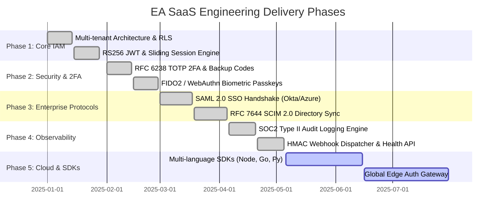

# 🗺️ Enterprise Authentication SaaS — Task Breakdown & Development Roadmap

> **Author:** Bilal Hussain (`bilalhusain-dev`)  
> **Lifecycle Standard:** 18-Step Vibe Coding & Production Engineering Framework

---

## 📅 Roadmap Overview

---

## 📋 Granular Task Matrix

### Phase 1: Foundation & Core Identity (Completed)
- [x] Multi-tenant organization isolation with PostgreSQL RLS.
- [x] Next.js 15 App Router architecture with server action encapsulation.
- [x] Asymmetric RS256 token issuance with public JWKS key rotation endpoint.
- [x] Granular Role-Based Access Control (RBAC): `OWNER`, `ADMIN`, `SECURITY_OFFICER`, `MEMBER`.

### Phase 2: Zero-Trust Security & Multi-Factor (Completed)
- [x] Time-based One-Time Password (TOTP) engine with 30s RFC 6238 window.
- [x] Cryptographic single-use backup code generator (SHA-256 hashed).
- [x] FIDO2 WebAuthn credential registration and biometric login flow.
- [x] Zero-Trust session revocation table with remote device termination.

### Phase 3: Enterprise Directory & SSO Protocols (Completed)
- [x] SAML 2.0 Service Provider (SP) metadata generation & IdP assertion parser.
- [x] RFC 7644 SCIM 2.0 RESTful endpoints (`/api/v1/scim/v2/Users`, `/Groups`).
- [x] Automated user lifecycle syncing (provisioning, updates, de-provisioning).
- [x] Machine-to-machine API key creation with hashed secret storage and permission scopes.

### Phase 4: Compliance, Auditing & Webhooks (Completed)
- [x] Immutable compliance audit logging stream with actor IP and User-Agent capture.
- [x] HMAC-SHA256 signed event dispatching for tenant webhook endpoints.
- [x] Shadow IT SaaS app governance tracker.
- [x] Health & telemetry endpoint (`/api/v1/health`).

### Phase 5: Enterprise SDKs & Global Edge Scale (Active)
- [ ] TypeScript/JavaScript Universal Client SDK (`@ea-saas/sdk`).
- [ ] Python backend middleware for FastAPI and Django.
- [ ] Vercel Edge Middleware starter template.
- [ ] Kubernetes Helm chart for self-hosted sovereign enterprise deployments.
