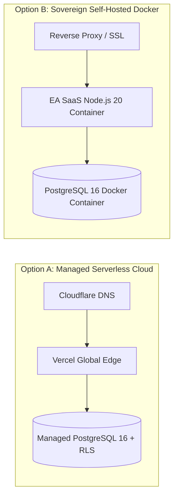

# 🚀 Enterprise Authentication SaaS — Deployment & Monitoring Architecture

> **Author:** Bilal Hussain (`bilalhusain-dev`)  
> **Lifecycle Standard:** Stage 15 (Preview Deploy), Stage 17 (Production Deploy), Stage 18 (Monitoring)

---

## 🌐 1. Preview Deployment Workflow (Stage 15)

Every pull request triggers an isolated preview deployment on **Vercel** with:
* Automated branch URL generation (`https://enterprise-auth-saas-git-<branch>-bilalhusain-dev.vercel.app`)
* Ephemeral database branching for PR isolation
* Preview environment variable validation

---

## 🚢 2. Production Deployment (Stage 17)

### Architecture Options:



### Self-Hosted Production Quickstart (Docker Compose):
```bash
# 1. Clone repository
git clone https://github.com/bilalhusain-dev/enterprise-authentication-saas.git
cd enterprise-authentication-saas

# 2. Configure environment
cp .env.example .env.production

# 3. Spin up full production cluster
docker compose up -d
```

---

## 📈 3. Observability & Monitoring (Stage 18)

### Health Check Endpoint
* **Path:** `/api/v1/health`
* **Response:**
  ```json
  {
    "status": "healthy",
    "version": "1.0.0",
    "uptimeSeconds": 14280,
    "database": { "status": "connected", "latencyMs": 4 },
    "security": { "jwksKeyRotation": "active", "scimStatus": "operational" }
  }
  ```

### Telemetry & Audit Stream
1. **Audit Logs:** Immutable streaming of authentication events (actor, IP, user-agent, timestamp, action).
2. **Error Tracking:** Native Sentry integration for real-time frontend and edge route exception tracking.
3. **Uptime Monitoring:** Pingdom / BetterStack HTTP heartbeats on `/api/v1/health` with 99.99% SLA alerts.
